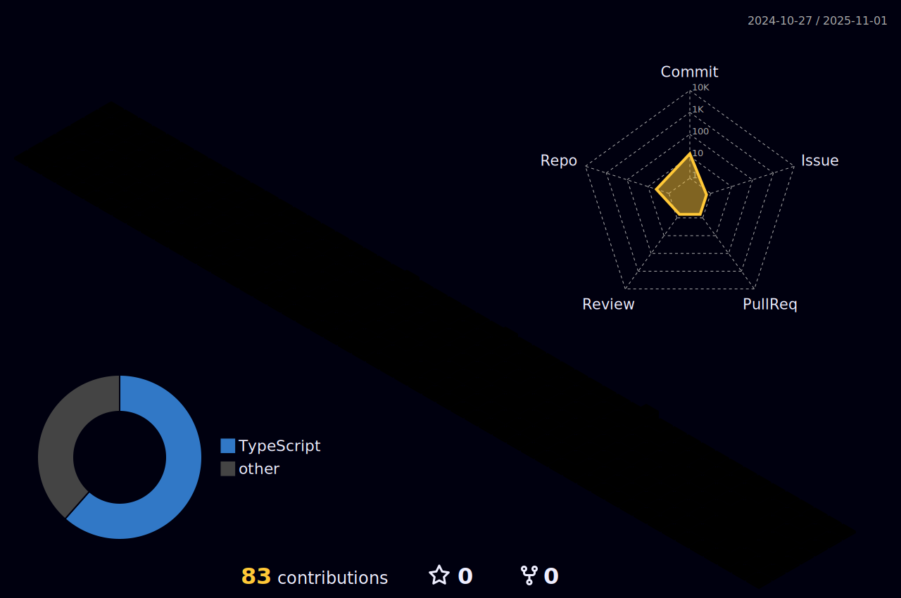

 |  |  |  
 | ----------- | ----------- |

## Tecnologias que utilizo no meu dia-a-dia

  
  
  
  
  
  
  
  
   

 

Apaixonado por tecnologia e por criar experiências web intuitivas e visualmente atraentes. Constantemente buscando aplicar as novas tecnologias e aprendizados para melhorar a usabilidade e a interatividade dos sites, desenvolvendo interfaces de usuário responsivas, acessíveis e otimizadas para diversos dispositivos e navegadores.
 

